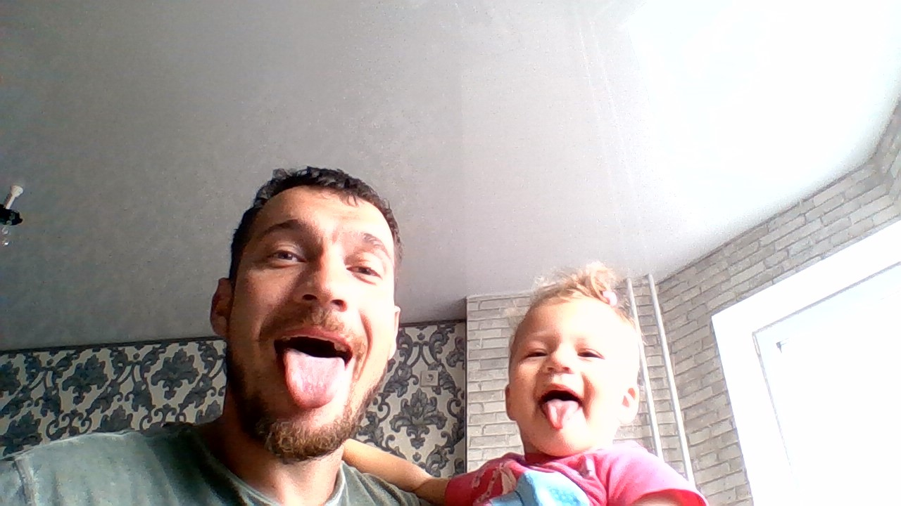

# Инструкция по работе с Markdown

## Выделение текста
чтобы выделить текст курсивом необхолимо обрамить его звездочками (*) или знаком нижнего подчеркивания (_) например *вот так* или _вот так_

что бы сделать полужирны выделяем двумя звездочками (**) **вот так** или двойным знаком нижнего подчеркивания (__) __вот так__
альтернативные способы выделениея жирным или курсивом нужны что бы комбинировать, напрмер _текст курсивный и при этом **полужирный**_ 
что бы сделать зачеркнутый - используй двойную тильду (~~) ~~вот так~~

## Работа с изображениями
чтоб ы вставить изображение в текст достаточно написать следующее 
## Ссылки
* ссылки выделяются - квадратными скобками ([ ]) - кнопка, затем в круглых URL и всплывающий тайтл. [переход на поиск](yandex.ru "поисковик")
*  ссылки без тайтла -в квадратных скобках([ ]) кнопка для перехода, затем в круглых адрес [поисковик](yandex.ru)
* что бы указать безанкорную ссылку используй угловые скобки (<>) например <https://yandex.ru/>

## списки
 что бы добавить не нумерованные списки необходимо пункты выделить (*) или знаком (+) например, вот так
 * мухоморы
 * сыроежки 
 * опята
 + подосиновики
 чтобы добавить нумерованные - просто нумеруем элементы, вот так:
 1. клубника
 2. малина
 3. вишня

## работа с таблицами
Для этого используются всего два символа: вертикальная черта и дефис. Дефисы работают примерно так же, как в случае с горизонтальной линией: отделяют заголовки от других строк, при этом количество символов значения не имеет. Вертикальная черта служит границей между столбцами. Например | ---- | ---- |
| musroom | eat or not |
|---------:|----------:|
| мухомор | не съедобен|
| подосиновик | съедобен |
| Белый гриб | съедобен 
## Цитаты
цитаты задаются угловой скобкой 
> это начало цитаты

> это все еще цитата

а вот тут она закончилась

## Заключение
В заключении отметим простоту синтаксиса MD, было ~~увлекательно~~ интересно, **ждем продолжениея**
